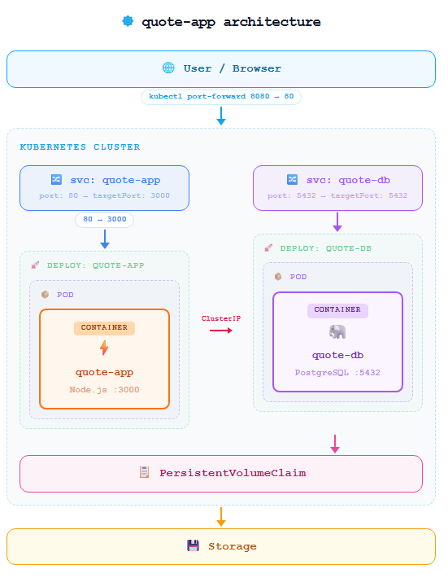
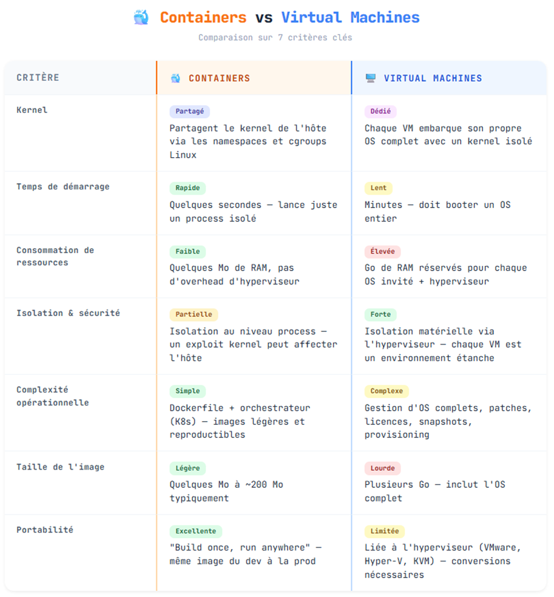
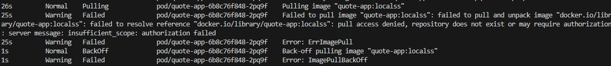

# **_Step 2_**

**Where does isolation happen?**  
L’isolation a lieu entre le user et les pods, il ne peut pas communiquer avec l’app sans passer par le service et pas avec la db sans passer par l’app

**What restarts automatically?**

Tout ce qui est dans le déploiement, le pod contenant les 2 containers

**What does Kubernetes *not* manage?**

Kubernetes ne gère pas directement le stockage physique (disque dur, cloud)

# **_Step 3_**

**When would you prefer a VM over a container?**

Une VM a son propre OS qui tourne, permettant un usage illimité tandis qu’un container est un simple (potentiel ensemble de) processus

**When would you combine both?**

On peut combiner les 2 lorsque l’on veut isoler nos containers dans 2 systèmes différents entre eux fortement et pour des raisons de cybersécurité.

# **_Step 4_**

**What changes when you scale?**

Plusieurs Pods sont créés.
Le load-balancer renvoie automatiquement vers les Pods.
Plus de charge possible

**What does not change?**

Le moyen d'accéder au service reste le meme.
Le nombre de pod de la base de données reste le même si l'on scale l'app.
Le fonctionnement reste le même.

# **_Step 5_**

**Who recreated the Pod?**

C'est le replica set de K8S qui a recréé le pod

**Why?**

Parce que le nombre de pods désirés était différent du nombre de pods réel (3 vs 2)

**What if the node itself failed?**

Si cluster multi-node : le scheduler recrée les Pods sur un autre node. Sinon ca devient indisponible.

# **_Step 6_**

**What are requests vs limits?**

Les Requests sont les ressources assignées par defaut
Les Limits sont les ressources maximums assignables.

**Why are they important in multi-tenant systems?**

Ca permet d'éviter qu'une instance consomme toutes les ressources et de planifier les couts.

# **_Step 7_**

**What is the difference between readiness and liveness?**

**Liveness** détecte si l’application est bloquée.
→ Redémarre le container si échec.

**Readiness** détecte si l’application est prête à recevoir du trafic.
→ Retire temporairement le Pod du Service.

**Why does this matter in production?**

Ca évite d’envoyer du trafic à un Pod non prêt et évite les redémarrages inutiles.

## **Connect Kubernetes to virtualization**

**What runs underneath k3s?**

Un OS Linux ou éventuellement une VM

**Is Kubernetes replacing virtualization?**
Non, Kubernetes orchestre les containers et gère leur scaling.
La virtualisation exécute des systèmes d'exploitations complets.

**In cloud providers, what hosts your nodes?**

Des VMs :

AWS → EC2

Azure → Virtual Machines

### **Stack Examples**

**Cloud Data Center**

Hardware → Hypervisor → VM → Kubernetes → Containers

**Embedded Automotive System**

Hardware → Linux → k3s → Containers

**Financial Institution**

Hardware → Hypervisor → VM cluster → Kubernetes cluster → Containers

# **Step 8**

**What would run in Kubernetes?**

- Quote app
- DB persistence
- Monitoring
- Logging

**What would run in VMs?**

- K8S nodes

**What would run outside the cluster?**

- CI/CD
- DNS
- Backups

# **Step 9**

**Failure :**

# **Step 10**

**Why is this better than plain-text configuration?**

De cette manière, pas de credentials dans Git, risque de leak, séparation configuration / code.

**Is a Secret encrypted by default? Where?**
Non, ils sont seulement encodés en base 64 mais pas chiffrés.
Les secrets sont stockés dans etcd, la db interne de k8s.
