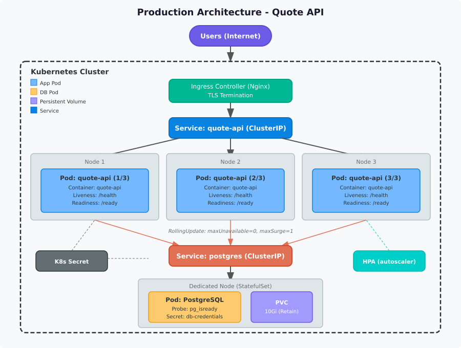

# Current System Problems

## 1. What is the problem with running the app and the database in the same container?

L'API Quote et PostgreSQL tournent dans le meme conteneur, dans un seul Pod. Si l'un des deux plante, l'autre tombe aussi. On ne peut pas scaler l'appli sans dupliquer la base de donnees, ce qui n'a pas de sens.

## 2. Why is the lack of persistent storage a problem?

Les donnees de PostgreSQL sont stockees directement dans le conteneur. Si le Pod redemarre ou est supprime, toutes les donnees sont perdues. Une simple mise a jour peut tout effacer.

## 3. Why are plaintext secrets dangerous?

Les mots de passe sont ecrits directement dans les variables d'environnement du Deployment. N'importe qui avec acces au YAML ou au cluster peut les voir. C'est un gros risque de securite.

## 4. What happens without liveness and readiness probes?

Kubernetes n'a aucun moyen de savoir si l'appli fonctionne encore. Meme si elle est bloquee, le Pod reste "Running" et continue de recevoir du trafic. Il n'y a pas non plus de redemarrage automatique.

## 5. What is the risk of having no resource limits?

Sans `requests` ni `limits`, un conteneur peut utiliser toute la memoire et le CPU du noeud. Ca peut faire planter tous les autres Pods qui tournent sur le meme noeud.

## 6. Why is a single Pod on a single node a problem?

Il n'y a qu'un seul Pod et aucune redondance. Si le Pod ou le noeud tombe, le service est completement coupe. Il n'y a aucune haute disponibilite.

## 7. What goes wrong without a proper deployment strategy?

Les Pods sont remplaces d'un coup. Si la nouvelle version a un bug, tout le service tombe sans possibilite de revenir en arriere automatiquement.

---

# Production Architecture

## What does the improved architecture look like?

L'idee c'est de separer l'appli de la base de donnees, avoir plusieurs repliques de l'appli, et ajouter de la persistence et de la securite.

### Application (Deployment)

- 3 repliques de l'API Quote
- Liveness probe sur `/health` (toutes les 10s)
- Readiness probe sur `/ready` (toutes les 5s)
- Ressources : requests 128Mi RAM / 100m CPU, limits 256Mi RAM / 250m CPU
- Les secrets sont passes via des objets Kubernetes `Secret`
- Strategie de deploiement : RollingUpdate (`maxUnavailable: 0`, `maxSurge: 1`)

### Application Service

- Un Service de type ClusterIP devant les 3 Pods
- Un Ingress Controller (Nginx) pour l'acces depuis l'exterieur avec TLS
- Port 80 qui redirige vers le port 3000 de l'appli

### PostgreSQL Database (StatefulSet)

- 1 replique geree par un StatefulSet
- Un PersistentVolumeClaim de 10Gi avec politique `Retain`
- Probes avec `pg_isready`
- Ressources : requests 256Mi RAM / 250m CPU, limits 512Mi RAM / 500m CPU
- Le mot de passe est dans un Secret Kubernetes

### Database Service

- ClusterIP sur le port 5432
- Accessible uniquement depuis l'interieur du cluster

## Architecture Diagram

---

# Operational Strategy

## How does the system scale?

L'appli a 3 repliques de base. Si le trafic augmente, on peut ajouter un HorizontalPodAutoscaler (HPA) qui cree automatiquement plus de Pods quand le CPU est trop utilise. Le Service repartit le trafic entre tous les Pods. La base de donnees ne scale pas horizontalement, mais on peut lui donner plus de ressources si besoin.

## How are updates deployed safely?

On utilise la strategie RollingUpdate. Kubernetes cree d'abord un nouveau Pod avec la nouvelle version, attend qu'il passe la readiness probe, puis supprime un ancien Pod. Comme `maxUnavailable` est a 0, il y a toujours au moins 3 Pods actifs pendant le deploiement. Si quelque chose se passe mal, on peut faire un `kubectl rollout undo` pour revenir a la version precedente.

## How are failures detected?

- Les liveness probes detectent si un conteneur est bloque et le redemarrent automatiquement
- Les readiness probes retirent un Pod du Service s'il n'est pas pret, pour ne pas lui envoyer de trafic
- Pour PostgreSQL, `pg_isready` verifie que la base accepte les connexions

## Which Kubernetes controllers handle recovery?

- **Deployment controller** : s'assure qu'il y a toujours 3 Pods de l'appli qui tournent. Si un Pod meurt, il en recree un.
- **StatefulSet controller** : gere le Pod PostgreSQL. Si le Pod plante, il le recree et le reconnecte au meme volume de donnees.
- **Kubelet** : sur chaque noeud, il surveille les probes et redemarre les conteneurs qui echouent.
- **kube-scheduler** : si un noeud tombe, il replace les Pods sur d'autres noeuds disponibles.

---

# Weakest Point

## What is the weakest part of the architecture and why?

Le point le plus faible c'est la base de donnees PostgreSQL. Meme avec un StatefulSet et un PersistentVolume, il n'y a qu'une seule instance. Si elle plante, le StatefulSet la recree, mais pendant ce temps l'appli ne peut ni lire ni ecrire de donnees.

Si le trafic est multiplie par 10, l'appli peut scaler (plus de Pods), mais tous les Pods se connectent a la meme base de donnees. PostgreSQL deviendrait le goulot d'etranglement avec trop de connexions et trop de requetes.

Pour ameliorer ca, on pourrait utiliser un pool de connexions (comme pgbouncer) ou mettre en place des replicas en lecture.
